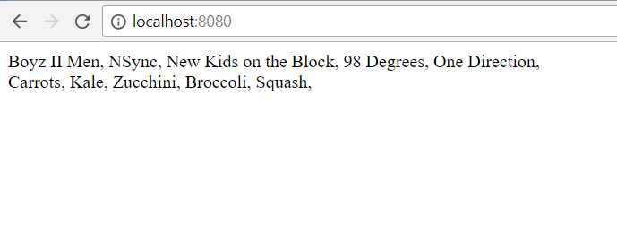

# Boy bands and Vegetables

## Requirements

Paste the following code into the `<body>` of the HTML file.

```html
<div id="boy-bands">
</div>

<div id="vegetables">
</div>
```

Paste the following code into your JavaScript file.

```js
var bands = ["Boyz II Men", "NSync", "New Kids on the Block", "98 Degrees", "One Direction"];
var vegetables = ["Carrots", "Kale", "Zucchini", "Broccoli", "Squash"];

// The number of loops to perform (what if the array changes?)
var loopCount = 5;

// Keep track of which band we're on in the loop
var currentBand = "";

// Keep track of which veggie we're on in the loop
var currentVeggie = "";

// Get a reference to the appropriate DOM element for bands
var bandElement = document.getElementById(???);

// Get a reference to the appropriate DOM element for vegetables
var veggieElement = ???;

// Start looping
for (var loopTracker = 0; loopTracker < loopCount; loopTracker += 1) {
  
  // Add the band names into the correct <div>
  currentBand = ???;

  
  // Add the veggie names into the correct <div>
  currentVeggie = ???;

}
```


Loop through the two arrays provided (`bands` and `vegetables`) and output each element in the arrays into their corresponding HTML `<div>` element. Ensure that each item is in a block element (e.g. li, div, p. etc...)

### Screen Shots



### How do I run this project locally?

In order to run this project on your computer, please complete the following steps:
  1. Clone the project by clicking on the green "Clone or Download" button above.
  1. Run your terminal, type in git clone, then paste the information that was copied from github.
  1. Inside the project folder, type in http-server -c-1.
  1. Launch your internet browser and navigate to http://localhost:8080.